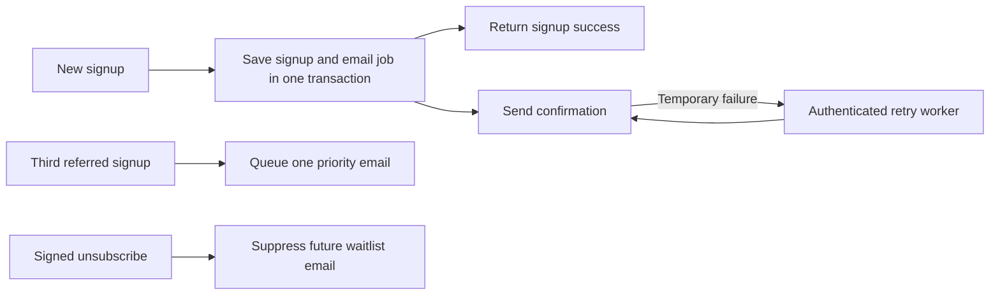

# OpenSwarm waitlist emails

The email flow extends the existing email waitlist and preserves its signup response. Sending is **off by default**. No real emails were sent, no live database was migrated, and no provider credentials were configured while building this addition.

## Preview the design

```sh
npm run email:preview
```

Open [localhost:4312](http://localhost:4312). The gallery switches between confirmation and priority emails, desktop and 390px mobile widths, and a simulated dark inbox background. It also includes plain-text versions. The preview server only serves generated files and artwork; it has no delivery transport.

`npm run email:build` exports the [gallery](email-preview/index.html), [confirmation](email-preview/welcome.html), [priority message](email-preview/priority.html), and matching `.txt` files. These are review artifacts with fictional referral codes, inactive unsubscribe tokens, and relative image paths. Production messages are rendered per recipient with absolute HTTPS asset URLs and signed unsubscribe links.

The refined design uses a 560px white reading column, small original octopus wordmark, and one restrained invitation illustration. Helvetica Neue with Segoe UI/Helvetica/Arial fallbacks provides warmer, quieter typography: 28px regular-weight headings (26px on mobile), 15px/24px body text, and 17px secondary headings. A fine divider introduces the three-referral benefit and a compact, left-aligned sharing button. HTML tables and inline styles keep the confirmation, referral offer, and links readable when images are blocked. No external font download is required.

The supplied [LaunchList article](https://getlaunchlist.com/blog/waitlist-email-templates-that-get-opened) and [Crafting Emails examples](https://craftingemails.com/vari-waitlist-email-templates) informed the sequence: confirm the signup, set expectations, offer one clear action. Copy and implementation are original. No purchased template code was used.

### Visual reference lock and artwork

The user-supplied Jev email screenshot anchors the compact, letter-like hierarchy and direct confirmation. Crafting Emails contributes a single primary action and a friendly illustration. OpenSwarm contributes the original coral mark and the three-friend reward. The user requested smaller, less cold typography and a sleek design; the refinement removes the oversized celebration panel, slogans, numbered tiles, and dark promotional card. Refero’s live search was unavailable, so its bundled typography guidance and the supplied references informed the build.

`public/media/email/invitations.jpg` is original synthetic artwork generated with Higgsfield GPT Image 2 on September 30, 2026. Its art direction is three translucent vellum invitations, one coral insert, soft daylight, a pure white background, and no text or logos. The 2688 × 1152 source was resized to 1120 × 480 JPEG (about 53KB), displayed at up to 560 × 240. The paper and artwork remain white in the dark preview, with a dark outer canvas and readable footer. The original logo is reused separately, unchanged. The image is decorative; it does not claim that access invitations have already been issued.

## What subscribers receive

| Trigger | Subject | Content and action |
| --- | --- | --- |
| New saved email signup while delivery is enabled | You're on the OpenSwarm waitlist | Confirms the saved spot and explains that access will arrive by email. “Share your invite” opens a prepared email draft containing the personal referral URL; the same URL is visible for copying. |
| Third unique referred signup | You've unlocked priority early access | Confirms the existing three-referral milestone. Explains that the actual invitation will arrive separately. Links back to the product section. |
| Duplicate signup | No new email | Returns existing referral progress without changing attribution, resending, or undoing an opt-out. |
| Unsubscribe | No additional confirmation email | Suppresses future waitlist messages while retaining the saved signup and referral history. |

The flow does not invent a launch date, queue position, first name, or ready-to-use account. It does not implement double opt-in, account activation, or an automatic launch campaign. Later invitations should be sent only once access is actually ready.



## Activate delivery

Sending is controlled in the admin dashboard (**Settings → Email signup**). Only the SMTP credentials live in the hosting environment.

1. Apply the migrations in [sql/](../sql/) in order through `007_email_admin.sql`. `006_waitlist_email_delivery.sql` adds private opt-out metadata and the durable queue; `007_email_admin.sql` adds the priority email setting, connects unsubscribe and reporting to the queue, and gives the website's database role access to it. Both are additive and rerunnable. They do not enqueue existing contacts.
2. Set the server-only SMTP settings in the hosting environment: `SMTP_HOST`, `SMTP_PORT` (587), `SMTP_USER` and `SMTP_PASSWORD`. For Google Workspace use `smtp.gmail.com` and an app password for the sending mailbox. Optionally set `RESEND_API_KEY` as a backup sender: when SMTP definitely did not take a message (it could not connect, the login failed, or it refused the message), the same message goes through Resend with the queue's idempotency key; an ambiguous SMTP timeout is retried later instead, so a message is never handed to both. Verify the sender's domain in Resend first. Optionally set `CRON_SECRET` (at least 32 bytes) so the daily Vercel Cron run in `vercel.json` can retry leftovers, and `WAITLIST_EMAIL_SECRET` to sign unsubscribe links independently of `ANALYTICS_SALT`.
3. Deploy. Email links, artwork and unsubscribe URLs use the Vercel project's production domain (`VERCEL_PROJECT_PRODUCTION_URL`), so they move to openswarm.com automatically when that domain is attached. `WAITLIST_EMAIL_PUBLIC_URL` overrides this.
4. In the dashboard, set the sender name and address (the SMTP mailbox or one of its aliases), reply-to and the postal address. Preview both emails, send yourself a test of each, and check them in real inboxes.
5. Switch on the welcome email and, if wanted, the priority email.

Without SMTP settings, or with emails switched off, signups behave exactly as before and nothing is queued. There is no historical backfill when emails are switched on. Local Vite development never sends email.

Keep the signing secret unchanged after sending starts so existing unsubscribe links keep working.

## Delivery and failure behavior

With valid delivery configuration, the signup and welcome job commit together. A failed queue write rolls back the signup instead of losing its email. Inviter row locking serializes concurrent referral increments, and a unique event constraint allows only one welcome and one priority job per signup. Legacy phone contacts can still contribute referral progress but cannot receive email.

Workers use row locks, expiring leases, and lease tokens so competing workers do not finalize one another's jobs. Before sending, the exact recipient, rendered payload, and hash are saved, and retries reuse that payload. Transient failures receive bounded backoff; permanent SMTP rejections (5xx, except authentication errors) stop retrying. SMTP has no idempotency key, so a send whose response is lost after the server accepted it can arrive twice when retried. Resend retries reuse the same idempotency key.

There are at most eight attempts, and retries stop 23 hours after the first attempt. Do not reset an expired job and resend blindly. A job left pending goes out with the next signup, the daily Vercel Cron run, or **Email → Send pending now** in the dashboard.

The `sent` status means a sender accepted the message, not that an inbox received it. Bounces of SMTP mail arrive in the sending mailbox. The dashboard's Email page shows sent, pending, failed and cancelled counts from the queue, plus the engagement below.

## Email analytics

| Measure | How | Coverage |
| --- | --- | --- |
| Opens | A 1×1 image at `/api/email/open` with a signed token | Approximate: Apple Mail preloads images and many apps block them |
| Clicks | The main button goes through `/api/email/click` (signed token, fixed destinations, no open redirect) | Welcome "Share your invite" and priority "Explore OpenSwarm". The visible invite link is never wrapped, so friends' visits still count as invites |
| Email channel | The priority email's Explore link carries `utm_source=waitlist-email&utm_medium=email&utm_campaign=priority` | Those visits appear under the Email channel on the Traffic page |
| Delivered, bounced, delayed, complaints | Resend webhooks at `/api/email/resend-webhook`, verified with `RESEND_WEBHOOK_SECRET` | Only emails the Resend backup sent |
| Unsubscribes | Signed unsubscribe link | All emails |

Opens and clicks from bots, link scanners and `HEAD` requests are stored but flagged and left out of rates. Tokens identify the queued email, not the person, and cannot be forged for someone else's email. In Resend, leave its own open and click tracking off so links are not wrapped twice; create a webhook for `email.delivered`, `email.delivery_delayed`, `email.bounced` and `email.complained` pointing at `https://<site>/api/email/resend-webhook`, and put its signing secret in `RESEND_WEBHOOK_SECRET`.

Unsubscribe URLs use an HMAC signature; knowing a public referral code is insufficient to opt someone out. GET shows a confirmation page without changing preferences, so ordinary link scanners cannot unsubscribe a person. POST performs the opt-out and supports the `List-Unsubscribe-Post` one-click header. Pending work is cancelled and workers recheck preferences before sending. An email already handed to the provider may still arrive after an opt-out.

Implementation references: [Nodemailer SMTP](https://nodemailer.com/smtp/), [Vercel background work](https://vercel.com/docs/functions/functions-api-reference/vercel-functions-package), and [Gmail CSS support](https://developers.google.com/workspace/gmail/design/css).

## Verification

```sh
npm run build
npm run lint
node --experimental-strip-types --test server/*.test.ts
```

The September 30 verification passed 53 tests, including the embedded SQL test, with the live PostgreSQL suite explicitly skipped. The production build passes; lint reports only the existing scene warnings.

Tests cover rendering and escaping, HTML/plain-text parity, configuration gating, provider failure classification, signup response preservation, worker authentication, signed opt-out, transaction rollback, duplicate suppression, referral milestones, immutable retry payloads, lease recovery, and the retry deadline.

An isolated PGlite test executes the actual migrations and queue SQL with synthetic data. To run it, set `PGLITE_TEST_MODULE` to an installed PGlite module path and run the same test command. The optional `TEST_DATABASE_URL` suite uses a disposable schema in a real PostgreSQL instance to exercise multiple connections. Neither test reads the private local signup store.

Browser previews verify layout and controls, not actual Gmail, Apple Mail, or Outlook rendering. Dark-mode previews force the optional media rules for review; real clients can recolor email differently. Live inbox delivery, sender-domain setup, hosted bundling, and the real multi-connection PostgreSQL suite remain activation checks.
